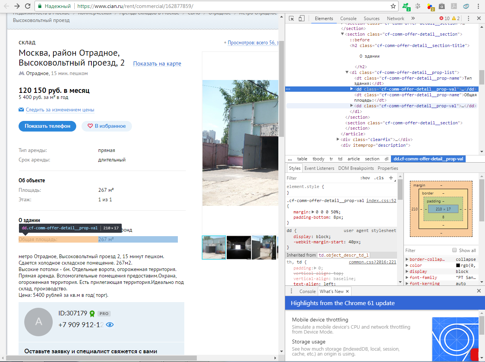

# Скачивание объявлений аренды склада с ЦИАН

Для решения собственных практически полезных задач анализа данных необходимо уметь выгружать данные с веб-страниц. Как правило, веб-страница - это документ, содержащий структурированные размеченные данные (с указанием на вид(текст, таблица, заголовок и т.п.)). Наиболее популярными инструментами создания структуры и разметки являются языки HTML и XML. HTML ([HyperText](https://ru.wikipedia.org/wiki/%D0%93%D0%B8%D0%BF%D0%B5%D1%80%D1%82%D0%B5%D0%BA%D1%81%D1%82) Markup Language) является наиболее распространенным инструментом представления веб-страниц, именно его интерпретирует браузер. Он позволяет структурировать данные, но его основное предназначение - визуальное отображение. XML (eXtensible Markup Language) предназначен для структурирования, хранения и передачи данных. HTML и XML очень похожи: данные представляются в виде дерева и могут быть преобразованы друг в друга, хотя имеют некоторые существенные [отличия](https://www.w3schools.com/xml/xml_whatis.asp).

 

HTML/XML документы хранятся на [сервере](https://ru.wikipedia.org/wiki/%D0%A1%D0%B5%D1%80%D0%B2%D0%B5%D1%80_(%D0%B0%D0%BF%D0%BF%D0%B0%D1%80%D0%B0%D1%82%D0%BD%D0%BE%D0%B5_%D0%BE%D0%B1%D0%B5%D1%81%D0%BF%D0%B5%D1%87%D0%B5%D0%BD%D0%B8%D0%B5)). Для перехода на веб-страницу компьютер пользователя отправляет на сервер запрос (request), получает ответ (response) в виде документа HTML/XML (и т.п.), браузер пользователя считывает этот документ, и пользователь видит веб-страницу. 


Для того, чтобы отправить запрос на сервер, получить ответ необходимо сначала установить между сервером и пользовательским компьютером двусторонее интернет-соединение для обмена данными. Для этого существуют разничные механизмы - протоколы передачи данных ([TCP/IP](https://www.objc.io/issues/10-syncing-data/ip-tcp-http/#http-hypertext-transfer-protocol)). После установки соединения возможна отправка запросов по протоколу [HTTP](https://www.objc.io/issues/10-syncing-data/ip-tcp-http/#http-hypertext-transfer-protocol)(HTTPS-safe HTTP). Для получения хранящегося на сервере документа, веб страницы используется метод GET протокола HTTP(S).

В R есть различные библиотеки, позволяющие отправлять на сервер запросы (соединение устанавливается автоматически), получать HTML/XML документы и работать с ними. Самыми удобными и распространенными являются пакеты httr - для работы с запросами и rvest - для чтения HTML.

## Импорт библиотек
Подключим указанные библиотеки, а также пакет для работы с данными tidyr. При необходимости используйте install.packages("package") для установки пакетов. 
```{r}
library(httr)
library(rvest)
library(tidyr)
library(xml2)
```

## Анализ структуры страницы и получение части объявлений
### Анализ структуры ссылки на объявления

Посмотрим на адрес складских объявлений ЦИАН.

```{r}
url <- "https://www.cian.ru/cat.php?deal_type=rent&engine_version=2&offer_type=offices&office_type%5B0%5D=3&p=2&region=1"
```
URL (Uniform Resource Locator) состоит из нескольких частей:
* https - используемый протокол передачи данных
* www.cian.ru - полное доменное имя сайта - набора веб-страниц
  + www - префикс или домен 3-го уровня, обозначает принадлежность к World Wide Web
  + cian - имя сайта, домен 2-го уровня
  + ru - домен 1-го уровня, обозначающий принадлежность к русской части Интернет
* /cat.php - путь к файлу cat.php в файловом хранилище сервера
* ?deal_type=rent&engine_version=2... - параметры запроса, отделенные от основного адреса знаком ?  и разделенные между собой знаком &

Для обращения к сайту из R важно понимать структуру адреса сайта и использовать правильные параметры, чтобы правильно формировать запросы и получать нужную информацию. Часто бывает, что если сайт содержит несколько однотипных страниц под различными номерами, то адрес первой страницы отличается. Например, на сайте ЦИАН первая страница с объявлениями об аренде складов имеет адрес:https://www.cian.ru/snyat-sklad/, в то время как другие страницы имеют адрес, подобный указанному выше. Несмотря на это, первая страница может быть получена по адресу, аналогичному другим, с параметром p=1. В адресе выше нас интересует параметр p=2 - номер страницы, именно его следует менять при скачивании данных с разных по номеру страниц. На других сайтах могут меняться и другие параметры, поэтому первым этапом в скачивании данных с сайта явлется анализ его структуры, механизма изменения параметров при переходе на другие страницы.

### Формирование адреса страницы и GET запроса

Запишем базовый адрес, к которому через разделитель & будем добавлять параметр "p" с различными значениями. Обратите внимание, что порядок следования параметров обычно значения не имеет.
Запишем также новый адрес путем конкатенации строки базового URL и динамической строки параметра. Такой способ получения нового адреса немного грубый, но универсальный. Более изящно использовать query = list(param1 = "value1", param2 = "value2") в качестве аргумента функции GET(). query содержит список именованных значений параметров. При этом не обязательно передавать все параметры в query(см. далее)

```{r}
base_url <- "https://www.cian.ru/cat.php?deal_type=rent&engine_version=2&offer_type=offices&office_type%5B0%5D=3&region=1"
new_url <- paste(base_url,sprintf("page=%d",1),sep="&")
new_url

# [1] "https://www.cian.ru/cat.php?deal_type=rent&engine_version=2&offer_type=offices&office_type%5B0%5D=3&region=1&page=1"
```

Попробуем отправить GET запрос на новый адрес, используя функцию GET из httr. Переменную назовем response, поскольку она уже будет содержать ответ сервера.

```{r}
# Отправим get-запрос на сервер 
http_response <- GET(new_url)
# или, что то же самое
http_response <- GET(base_url,query = list(p="1"))
# Посмотрим на формат ответа
http_response


# Response [https://www.cian.ru/cat.php?deal_type=rent&engine_version=2&offer_type=offices&office_type%5B0%5D=3&region=1&p=1]
#   Date: 2017-10-02 17:27
#   Status: 200
#   Content-Type: text/html; charset=utf-8
#   Size: 607 kB
# <!DOCTYPE html>
# <html lang="ru">
#   <head>
#     <script>
#     if (window.performance && window.performance.mark) {
#       window.performance.mark('first-mark');
#     }
#     </script>
#     <title>Снять склад в Москве — 3 194 объявления</title>
#     <meta charset="UTF-8">
```

Видно, что ответ сервера имеет определенную структуру. Нас интересует код ответа (Status) и Content-Type или соответствующий заголовок документа <!DOCTYPE html>, содержащий информацию о формате полученного документа и его кодировке(utf-8). 200 - код успешного ответа. Коды, начинающиеся с цифры 4 будут свидетельствовать об ошибке на стороне клиента (404 page not found, 400 - bad request). 

### Анализ структуры веб-страницы

В ответ от сервера мы получили html-документ. Считать его можно функциями content() или read_html(). Обе функции преобразуют HTML в xml_document или дерево XML.


```{r}
# Для чтения содержимого документа используем функцию content(), она преобразует html в xml_document
xml_response <- content(http_response)
# Посмотрим, как выглядит ответ
xml_response

# {xml_document}
# <html lang="ru">
# [1] <head>\n<meta http-equiv="Content-Type" content="text/html; charset=UTF-8">\n<script>\ ...
# [2] <body>\n    \n  <div class="c-app-banner c-app-banner_hidden" id="mobile-banner" style ...

# То же функцией read_html
read_html(http_response)

# {xml_document}
# <html lang="ru">
# [1] <head>\n<meta http-equiv="Content-Type" content="text/html; charset=UTF-8">\n<script>\ ...
# [2] <body>\n    \n  <div class="c-app-banner c-app-banner_hidden" id="mobile-banner" style ...
```
Видно, что документ в корне разделяется на head и body - элементы. <head> и <body> - теги соответствующих элементов. Элементы могут иметь атрибуты, текстовое значение и содержать другие элементы. Более подробно об XML можно посмотреть [здесь](https://www.w3schools.com/xml/xml_tree.asp)

Изучение структуры документа следует производить "из-под" браузера - открыть в браузере страницу, кликнуть правой кнопкой по свободному месту -> "Посмотреть код"(Chrome)/"Исследовать элемент"(Mozila Firefox). Должен открыться интерактивный инструмент DevTools. Далее нажатием Ctrl+Shift+C можно перейти в режим исследования, позволяющем видеть кодовое представление и местонахождение элемента в дереве. Этот режим значительно упрощает анализ структуры страницы и позволяет быстро находить идентификаторы элементов с необходимыми данными.


Из всего документа нам нужны только объявления. Если аккуратно навести в режиме DevTools на объявление, можно увидеть следующий код
```{html}
<div class="offer-container--38nzf"><div
```
Другие объявления также являются элементами div с атрибутом class, значение которого -  offer-container--38nzf. Если внимательно изучить элементы объявлений, можно заметить, что первые три элемента в значении атрибута содержат и другую строку через пробел: class="offer-container--38nzf offer-container--top3--3QuJo". Для получения всех объявлений на странице следует использовать первое значение атрибута class, передавая его в XPath. Xpath - язык запросов к XML-дереву. Любой элемент в документе xml можно получить, написав правильный запрос.  Современные браузеры поддерживают извлечение XPath выбранного элемента в буфер обмена (копирование), и можно заметить, что путь к разным объявлениям отличается только их порядковым номером в конце: 

//*[@id="frontend-serp"]/div/div[5]/div[1] - XPath первого объявления

//*[@id="frontend-serp"]/div/div[5]/div[2] - XPath второго объявления

//*[@id="frontend-serp"]/div/div[5]/div[8]  - XPath восьмого объявления

Это можно использовать, если:
* известно количество подобных элементов на странице 
* это количество постоянно на других страницах (что требует дополнительных изысканий), ведь нам интересно скачать все объявления
* страница имеет хорошую структуру, и на ней не будет элементов- не объявлений, имеющих путь, подобный тому, который имеют объявления. В нашем случае это так, однако можно считать это везением

Поэтому продемонстрируем также использование значения атрибута class для поиска элементов - объявлений.

Запишем общее для всех элементов-объявлений значение атрибута class
```{r}
ad_class_name <- "offer-container--38nzf"
```
Для поиска элементов xml в rvest есть функция xml_find_all. На вход она принимает xml_document или xml_element, а также строку запроса XPath. Для написания таких запросов следует ознакомиться с [документацией](https://www.w3schools.com/xml/xml_xpath.asp).

```{r}
# Используем xmlPath для получения списка объявлений //* - все элементы, [содержащие атрибут (@) class со значением имени класса объявления]
ads <- xml_find_all(xml_response, sprintf("//*[contains(@class, '%s')]",ad_class_name))
# Посмотрим на полученный список
ads

# {xml_nodeset (28)}
#  [1] <div class="offer-container--38nzf offer-container--top3--3QuJo"><div class="containe ...
#  [2] <div class="offer-container--38nzf offer-container--top3--3QuJo"><div class="containe ...
#  [3] <div class="offer-container--38nzf offer-container--top3--3QuJo"><div class="containe ...
#  [4] <div class="offer-container--38nzf"><div class="container--3THDe ">\n<div class="medi ...
#  [5] <div class="offer-container--38nzf"><div class="container--3THDe ">\n<div class="medi ...
#  [6] <div class="offer-container--38nzf"><div class="container--3THDe ">\n<div class="medi ...
#  [7] <div class="offer-container--38nzf"><div class="container--3THDe ">\n<div class="medi ...
#  [8] <div class="offer-container--38nzf"><div class="container--3THDe ">\n<div class="medi ...
#  [9] <div class="offer-container--38nzf"><div class="container--3THDe container--colorized ...
#  ...

# Посмотрим на первый элемент - xml_nodeset - объявление
ads[1]

# {xml_nodeset (1)}
# [1] <div class="offer-container--38nzf offer-container--top3--3QuJo"><div class="container ...
```
То же можно сделать, используя [css selectors](https://www.w3schools.com/cssref/css_selectors.asp) и функцию html_node(xml_doc, css_selector). Для поиска по имени атрибута class в css нужно добавить перед именем "."
```{r}
ads <- html_nodes(xml_response, paste(".",ad_class_name,sep=""))
# Посмотрим на полученный список
ads

# [1] ".offer-container--38nzf"
# {xml_nodeset (28)}
#  [1] <div class="offer-container--38nzf offer-container--top3--3QuJo"><div class="containe ...
#  [2] <div class="offer-container--38nzf offer-container--top3--3QuJo"><div class="containe ...
#  [3] <div class="offer-container--38nzf offer-container--top3--3QuJo"><div class="containe ...
```
### Извлечение текста из xml элементов и нахождение других данных об объявлениях

Посмотрим на первый элемент - xml_nodeset - объявление
```{r}
ads[1]

# {xml_nodeset (1)}
# [1] <div class="offer-container--38nzf offer-container--top3--3QuJo"><div class="container ...
```

Для получения текста из элементов можно использовать xml_text(xml_doc). Поосмотрим, что получится, если передать в функцию целое объявление

```{r}
xml_text(ads[4])

# [1] "Склад 8 м?? за 5 903 руб./мес. 9 444 руб. за м?? в годДмитровская8 минут пешкомМосква, м. Дмитровская, район Бутырский, проезд Добролюбова, 3С7Компания \"Склад-24\" сдаёт в аренду контейнер под склад. На данной территории мы предлагаем контейнер площадью 7.5 кв. метров по самой низкой цене в Москве. В цену включены: круглосуточный доступ, охрана, видеонаблюдение, освещение, электричество, пропускной режим...Артемий МухановPROПоказать телефонВ избранноеПоказать на картеЕщё45 минут назадсегодня, 19:42"
```
Похоже на то, что мы действительно выделили объявление, однако общий текст составлен последоватеьно из всех текстовых элементов внутри объявления. С таким текстом неудобно работать.

Объявление, как и документ, имеет свою структуру. Необходимые данные внутри него представлены в виде дерева и добыть их можно аналогичными способами. Запишем имена классов для элементов заголовка, описания и станции метро

```{r}
headers_class_name <- "header-link--22fgv"
description_class_name <- "description--20a7r"
metro_class_name <- "underground-header--A7XgS"

# Для извлечения заголовка из первого объявления можно снова использовать xmlPath
# Нам нужны все(*) потомки (descendant) [содержащие имя класса, 
# соответсвующее имени класса для заголовков]
ads[1]
ad_header <- xml_find_first(ads[1],sprintf("descendant::*[contains(@class,'%s')]",headers_class_name))
ad_header

# {xml_nodeset (1)}
# [1] <a class="header-link--22fgv" href="https://www.cian.ru/rent/commercial/160205593/" ta ...
```
Или снова используем css selector "." для class
```{r}
ad_header <- html_node(ads[1],paste(".",headers_class_name,sep=""))
ad_header

# {xml_nodeset (1)}
# [1] <a class="header-link--22fgv" href="https://www.cian.ru/rent/commercial/160205593/" ta ...
```
Или более общее, но менее безопасное в случае неуникальных или коротких имен [class~=имя_класса], class~= означает поиск элемента, атрибут class которого содержит имя_класса
```{r}
ad_header <- html_node(ads[1],sprintf("[class~=%s]",headers_class_name))
ad_header

# {xml_nodeset (1)}
# [1] <a class="header-link--22fgv" href="https://www.cian.ru/rent/commercial/160205593/" ta ...
```

Выделим текст заголовка
```{r}
xml_text(ad_header)

# [1] "Склад 389 м?? за 175 050 руб./мес."
```
То, что нужно! Стоит отметить, что в данном случае можно найти элементы заголовков, описаний сразу в исходном документе, пропустив выделение элементов объявлений. Однако это работает только для хорошо размеченных страниц, и даже для них безопаснее сначала найти целые объявления, а уже внутри них искать нужную информацию. Это также позволяет обнаружить, в каком объявлении не указана информация, например, о станции метро

В R можно передать соответствующей функции сразу все объявления
```{r}
# Получим список заголовков всех объявлений на странице
ads_headers <- html_node(ads,paste(".",headers_class_name,sep=""))
# или
ads_headers <- xml_find_all(ads,sprintf("descendant::*[contains(@class,'%s')]",headers_class_name))
print(paste("Длина списка заголовков соответствует длине списка объявлений:",if(length(ads_headers)==length(ads)) "да"  else "Нет"))

# [1] "Длина списка заголовков соответствует длине списка объявлений: да"


print(paste("Первый заголовок:",xml_text(ads_headers[1])))

# [1] "Первый заголовок: Склад 389 м?? за 175 050 руб./мес."
```
### Скачивание данных с нескольких страниц

Пришло время скачать объявления с нескольких страниц. Для этого напишем некоторые функции. В них будет использоваться xml_path. Попрактикуйтесь и попробуйте использовать альтернативные методы html_node и css для поиска элементов и query для запросов GET
```{r}
# Для получения xml_document путем отправки запроса GET
# по адресу страницы с объявлениями с различными номерами (page_nums)
get_pages_content <- function(page_nums){
  lapply(page_nums, function(page_n){
    GET(paste(base_url,sprintf("page=%d",page_n),sep="&")) %>% content()
  })
}
# функция находит все объявления на странице
parse_page_ads <- function(page) {
  xml_find_all(page, sprintf("//*[contains(@class, '%s')]",ad_class_name))
}

# По заданному имени класса функция находит в объявлениях нужные элементы
parse_many_ads_by_class_name <- function(ads,class_name) {
  parse_ad_info_by_class_name <- function(ad, class_name) {
  xml_find_first(ad,sprintf("descendant::*[contains(@class,'%s')]",class_name))
  }
  lapply(ads,function(ad){
    parse_ad_info_by_class_name(ad,class_name)
    })
}

# Скачаем первые 3 страницы
pages <- get_pages_content(1:3)
pages

# [[1]]
# {xml_document}
# <html lang="ru">
# [1] <head>\n<meta http-equiv="Content-Type" content="text/html; charset=UTF-8">\n<script>\ ...
# [2] <body>\n    \n  <div class="c-app-banner c-app-banner_hidden" id="mobile-banner" style ...
# 
# [[2]]
# {xml_document}
# <html lang="ru">
# [1] <head>\n<meta http-equiv="Content-Type" content="text/html; charset=UTF-8">\n<script>\ ...
# [2] <body>\n    \n  <div class="c-app-banner c-app-banner_hidden" id="mobile-banner" style ...
# 
# [[3]]
# {xml_document}
# <html lang="ru">
# [1] <head>\n<meta http-equiv="Content-Type" content="text/html; charset=UTF-8">\n<script>\ ...
# [2] <body>\n    \n  <div class="c-app-banner c-app-banner_hidden" id="mobile-banner" style ...
```
На страницах найдем все объявления. функция lapply(iterable,FUN) вернет список списков объявлений, поэтому следует передать ее результат функции unlist без рекурсии, т.е без разворачивания уже развернутых элементов
```{r}
ads <- lapply(pages,parse_page_ads) %>% unlist(., recursive=FALSE)
print(length(ads))

# 84

ads[1:3]

# [[1]]
# {xml_node}
# <div class="offer-container--38nzf offer-container--top3--3QuJo">
# [1] <div class="container--3THDe container--top3--MTYNO ">\n<div class="media--v4Dr4 media ...
# 
# [[2]]
# {xml_node}
# <div class="offer-container--38nzf offer-container--top3--3QuJo">
# [1] <div class="container--3THDe container--top3--MTYNO ">\n<div class="media--v4Dr4 media ...
# 
# [[3]]
# {xml_node}
# <div class="offer-container--38nzf offer-container--top3--3QuJo">
# [1] <div class="container--3THDe container--top3--MTYNO ">\n<div class="media--v4Dr4 media ...
```
Теперь для всех объявлений на 3-х страницах найдем заголовки
```{r}
headers <- parse_many_ads_by_class_name(ads,headers_class_name)
headers[1]

# [[1]]
# {xml_node}
# <a class="header-link--22fgv" href="https://www.cian.ru/rent/commercial/153814597/" target="_blank">

headers_text <- lapply(headers, xml_text) %>% unlist()
headers_text[1:3]

# [1] "Склад 15 м?? за 9 900 руб./мес."       "Склад 2494 м?? за 1 371 700 руб./мес."
# [3] "Склад 50 м?? за 20 833 руб./мес."
```

Сделаем то же самое для текстовых описаний
```{r}
descriptions <- parse_many_ads_by_class_name(ads,description_class_name)
descriptions[1]

# [[1]]
# {xml_node}
# <div class="description--20a7r description--bucket2--1thVs">

descriptions_text <- lapply(descriptions, xml_text) %>% unlist()
descriptions_text[1]


# [1] "Компания \"Склад-24\" сдаёт в аренду контейнер под склад. На данной территории мы предлагаем контейнер площадью 15 кв. метров по самой низкой цене в Москве. В цену включены: круглосуточный доступ, охрана, видеонаблюдение через интернет, освещение, электричество, пр..."
```
Для станций метро
```{r}
metro_stations <- parse_many_ads_by_class_name(ads,metro_class_name)
metro_stations[1]

# [[1]]
# {xml_node}
# <a href="https://www.cian.ru/rent/commercial/153814597/" class="underground-header--A7XgS" target="_blank">


metro_stations_text <- lapply(metro_stations, xml_text) %>% unlist()
metro_stations_text


#  [1] "Коломенская"              "Новохохловская"           "Перово"                  
#  [4] "Нагатинская"              "Дмитровская"              "Парк Победы"             
#  [7] NA                         "Черкизовская"             "Речной вокзал"           
# [10] "Отрадное"                 "Южная"                    "Аннино"                  
# [13] "Черкизовская"             "Бутырская"                "Бутырская"               
# [16] "Марьино"                  "Ростокино"                "Новохохловская"          
# [19] "Дмитровская"              "Щукинская"                "Петровско-Разумовская"  
# ...
```
Отлично, видно, что станция метро указана не для всех объявлений, при этом длина списка станций соответствует кол-ву объявлений. Мы также можем извлечь адреса, явно указанные классы складов, стоимость аренды м2 в год.

```{r}
adderss_class_name <- "address-path--12tl2"

addresses <- parse_many_ads_by_class_name(ads,adderss_class_name)
addresses[1]

# [[1]]
# {xml_node}
# <div class="address-path--12tl2">
# [1] <a class="_38zPGmbr3GSDPyBo  item--2Hi72" href="https://www.cian.ru/snyat-sklad/" targ ...
# [2] <a class="_38zPGmbr3GSDPyBo  item--2Hi72" href="https://www.cian.ru/snyat-sklad-moskva ...
# [3] <a class="_38zPGmbr3GSDPyBo  item--2Hi72" href="https://www.cian.ru/snyat-sklad-moskva ...
# [4] <a class="_38zPGmbr3GSDPyBo  item--2Hi72" href="https://www.cian.ru/snyat-sklad-moskva ...
# [5] <a class="_38zPGmbr3GSDPyBo  item--2Hi72" href="/cat.php?deal_type=rent&amp;engine_ver ...

addresses_text <- lapply(addresses, xml_text) %>% unlist()
addresses_text[1:3]


# [1] "Москва, м. Коломенская, район Нагатино-Садовники, 2-й Нагатинский проезд, 2С4"   
# [2] "Москва, м. Новохохловская, район Текстильщики, 1-й Грайвороновский проезд, 20С35"
# [3] "Москва, м. Перово, район Перово, шоссе Энтузиастов, 72А" 
```
5 элементов соответствуют в данном случае 5-ти частям адреса

Аналогично для классов складов
```{r}
classType_class_name <- "header-classType--ECSQ1"

classTypes <- parse_many_ads_by_class_name(ads,classType_class_name)
classTypes[1]

# [[1]]
# {xml_missing}
# <NA>

classTypes_text <- lapply(classTypes, xml_text) %>% unlist()
classTypes_text


#  [1] NA         "Класс A"  "Класс B-" NA         NA         NA         NA         NA        
#  [9] NA         NA         NA         "Класс B"  NA         "Класс B+" NA         NA        
# [17] NA         NA         NA         NA         NA         NA         NA         NA        
# [25] NA         NA         NA         NA         NA         "Класс B"  NA         "Класс B+"
# ...
```
Большинство авторов объявлений не указали класс склада явно, но при чтении описаний выяснится, что класс указан именно в них.

Со стоимостью аренды м2 в год сложнее, поскольку ей не соответствует имякласса и какие-либо атрибуты - это просто комментарий в элементе div. Но можно выяснить, что эта информация находится на одном уровне с родителем элемента, который мы нашли для заголовков. Можно использовать эту информацию.
```{r}
xml_parent(xml_parent(headers[[1]])) %>% xml_children()

# {xml_nodeset (2)}
# [1] <h3 class="header-title--2JERe">\n<a class="header-link--22fgv" href="https://www.cian ...
# [2] <div>7 920 руб. за м?? в год</div>

# или лучше
xml_siblings(xml_parent(headers[[1]]))


# {xml_nodeset (1)}
# [1] <div>7 920 руб. за м?? в год</div>
```
В первом случае мы перешли по дереву вверх 2 раза, получили дедушку(родителя родителя) исходного элемента, а затем нашли его детей. Звучит забавно, но фактически это так и следует из терминологии xml. Здесь мы получаем список детей, в который входит уже найденный нами родитель, поэтому это избыточно. Во втором случае мы сначала нашли родителя исходного элемента, а затем получили его бартьев-сестер (siblings). В последнем случае мы уже имеем искомый элемент. Для того, чтобы проделать это со всеми объявлениями стоит помнить, что эта информация может быть не указана. Можно было бы использовать проверку длины списка найденных братьев-сестер, но R уже обо всем позаботился и передача xml_nodeset(0) в функцию xml_text даст NA

```{r}
prices_per_year_m2 <- lapply(headers,function(header){xml_siblings(xml_parent(header))})
prices_per_year_m2_text <- lapply(prices_per_year_m2,xml_text) %>% unlist()
prices_per_year_m2_text[1:30]


#  [1] "7 920 руб. за м?? в год"  "6 600 руб. за м?? в год"  "5 000 руб. за м?? в год" 
#  [4] "10 116 руб. за м?? в год" "9 444 руб. за м?? в год"  "10 104 руб. за м?? в год"
#  [7] "4 714 руб. за м?? в год"  "9 480 руб. за м?? в год"  "14 592 руб. за м?? в год"
# [10] "11 832 руб. за м?? в год" "18 024 руб. за м?? в год" "6 396 руб. за м?? в год" 
# [13] "7 116 руб. за м?? в год"  "3 600 руб. за м?? в год"  "3 600 руб. за м?? в год" 
# [16] "7 920 руб. за м?? в год"  "7 920 руб. за м?? в год"  "7 920 руб. за м?? в год" 
# [19] "7 920 руб. за м?? в год"  "7 920 руб. за м?? в год"  "4 000 руб. за м?? в год" 
# [22] "4 000 руб. за м?? в год"  "4 000 руб. за м?? в год"  "4 000 руб. за м?? в год" 
# [25] "4 000 руб. за м?? в год"  "7 516 руб. за м?? в год"  "7 200 руб. за м?? в год" 
# [28] "4 800 руб. за м?? в год"  "5 000 руб. за м?? в год"  "4 200 руб. за м?? в год" 
```
### Получение ссылок на страницы объявлений и извлечение данных с них
Если внимательно изучить страницы с объявлениями можно заметить, что объявления, выделенные желтым, могут повторяться на разных страницах и меняться при обновлении одной страницы - все это в рекламных целях. Для нас это означает, что при загрузке данных с разных страниц могут присутствовать дубликаты, а при многократном обращении к одной странице часть объявлений будет меняться. Для удаления дубликатов нужен уникальный идентификатор. Им может служить ссылка на объявление или ее часть, id. Ссылки нам понадобятся, т.к у объявления есть собственная страница с указанием более подробной информации. Подобная ситуация и со многими другими сайтами.

При скачивании данных о множестве однотипных элементов, в данном случае объявлений, нужно с самого начала определить, могут ли встречаться дубликаты и понадобится ли уникальный идентификатор. На практике часто нужно обработать несколько десятков, реже сотен, бывает, что и тысячи страниц. Это занимает продолжительное время, и лучше избежать перезапуска этой процедуры либо путем скачивания сначала документов со всех страниц, либо путем обнаружения и записи уникального идентификатора элементов, если по каким-либо причинам скачать/хранить все документы веб-страниц затруднительно.

Ссылку на страницу объявления можно заметить среди атрибутов найденных нами заголовков.Извлечь ее из тела xml_element/xml_nodeset можно функцией xml_attr(xml_el,"имя_атрибута"). Ссылки имеют имя атрибута "href"

```{r}
links_text <- lapply(headers, function(h){xml_attr(h,"href")}) %>% unlist()
head(links_text,3)

# [1] "https://www.cian.ru/rent/commercial/153814597/"
# [2] "https://www.cian.ru/rent/commercial/147862193/"
# [3] "https://www.cian.ru/rent/commercial/161947856/"

tail(links_text,3)

# [1] "https://www.cian.ru/rent/commercial/156987270/"
# [2] "https://www.cian.ru/rent/commercial/158384467/"
# [3] "https://www.cian.ru/rent/commercial/163618347/"

```
Запишем данные в таблицу data.frame
```{r}
(df <- data.frame(header = headers_text,link = links_text, description = descriptions_text, address  = addresses_text, price_per_year_m2 = prices_per_year_m2_text, classType = classTypes_text))
str(df)


# 'data.frame':	84 obs. of  6 variables:
#  $ header           : Factor w/ 74 levels "Склад 10 м?? за 17 060 руб./мес.",..: 24 37 54 66 70 65 21 71 52 67 ...
#  $ link             : Factor w/ 84 levels "https://www.cian.ru/rent/commercial/137702108/",..: 22 5 60 34 19 2 55 13 40 53 ...
#  $ description      : Factor w/ 81 levels "Cезонное хранение мото и спец .техники, квадроциклов, мотоциклов, скутеров, автомобильной резины и иных автомоб"| __truncated__,..: 20 46 2 26 21 25 31 21 60 28 ...
#  $ address          : Factor w/ 78 levels "Москва, м. Авиамоторная, район Лефортово, 2-я Кабельная улица, 2С1",..: 24 42 48 37 20 46 78 68 57 45 ...
#  $ price_per_year_m2: Factor w/ 58 levels "1 800 руб. за м?? в год",..: 50 38 27 4 57 3 25 58 7 6 ...
#  $ classType        : Factor w/ 5 levels "Класс A","Класс B",..: NA 1 3 NA NA NA NA NA NA NA ...
```

Выделим уникальные идентификаторы объявлений из ссылок. Нам повезло, дубликатов нет
```{r}
ids <- lapply(df$link, function(l){strsplit(as.character(l),"/")[[1]][6]} %>% as.integer) %>%     unlist()
df$id <- ids
str(df$id)

 # int [1:84] 153814597 147862193 161947856 156176664 152888635 140886399 161180454 150720635 157931082 161024236 ...

length(unique(df$id))

# [1] 84
```
Теперь посмотрим на структуру страницы объявления 



Заметно, что необходимая нам информация, содержится в элементах с именами классов cf-comm-offer-detail__prop-name - для обозначения названия характеристики(напр. тип здания, этаж) и cf-comm-offer-detail__prop-val - для обращения к значению характеристики(нежилой фонд, 20 м2). Анализ таких элементов на других страницах позволяет понять, что имена классов не изменяются, однако множества указанных характеристик меняется, т.е для одного объявления указан этаж, но не указан тип здания, для другого объявления - наоборот. Поэтому следует:
* сначала скачать все документы страниц объявлений
* пройдя по страницам, найти все названия характеристик
* для каждой страницы и характеристики получить значение характеристики по соответствующему запросу css или xpath

Скачаем страницы всех ранее найденных объявлений. Довольно часто возникают следующие проблемы:
* при запросе GET R отправляет на сервер заголовки по умолчанию и выдает этим свою нечеловеческую природу. Это вызывает автоматическую переадресацию на страницу капчи (Captcha). Для обхода следует изучить, какие заголовки отправляет Ваш браузер. Это можно сделать на панели [Network](https://stackoverflow.com/questions/4423061/view-http-headers-in-google-chrome) в DevTools в Chrome. В GET заголовки можно передать в аргументах с помощью add_headers("h1_name"="h1_value","h2_name"="h2_value",...). Заголовки нужно выбирать среди тех, где есть User-Agent, возможно, cookies(но обычно можно обойтись без них), главное здесь - экспериментировать и пробовать разные комбинации, если вдруг Вы натолкнулсь на captcha (посмотреть, натолкнулись ли Вы можно с помощью функции xml_text(документ всей страницы))
* R может генерировать запросы довольно часто (несколько раз в секунду). Сервер отслеживает IP адреса, отправляющие запросы слишком часто, и перенаправляет их на страницу капчи. Для обхода этого можно применять функцию Sys.sleep(time_in_seconds), которая останавливает выполнение кода на заданное кол-во секунд
Выглядит это так
```{r}
base_page_url <- "https://www.cian.ru/rent/commercial/"
ad_pages <- lapply(links_text, function(link) {
  page <- GET(link, add_headers("Accept"="*/*",
                      "Accept-Encoding"="gzip,deflate,br",
                      "Accept-Language"="ru-RU,ru;q=0.8,en-US;q=0.6,en;q=0.4",
                      "Connection"="keep-alive",
                      "Referer"="https://www.cian.ru/rent/commercial/161180454/",
                      "User-Agent"="Mozilla/5.0 (Windows NT 6.1; Win64; x64) AppleWebKit/537.36 (KHTML, like Gecko) Chrome/61.0.3163.100 Safari/537.36")) %>% content()
  Sys.sleep(0.5)
  page
  })
length(ad_pages)
# 84
xml_text(ad_pages[[84]])

# [1] "\n                Сдам склад город Москва, метро Бауманская, Бауманская улица д. 53С2 - база ЦИАН, объявление №163618347\n            \n        if (typeof window.cianConfig === \"undefined\") {window.cianConfig = {}}\n            window.cianConfig.openGraph = {\n                title: 'Сдается склад за 65 625 руб./месяц, 105.0 м??, этаж 1/5',\n                link: 'https://www.cian.ru/rent/commercial/163618347/',\n                description: 'Объект 367-5. Звоните с 8-00 до 20-00.  Сдаю в аренду склад площадью 105 кв.м.  на 1 этаже, в административном здании,  состоящее из 1 комнаты, стоимостью аренды 65 625 рублей в месяц, грузовой лифт, доступ: по документам, режим работы: с 08:00 до 00:00, доступ в выходной день: по заявке, коммунальные платежи влючены, депозит: 1 мес., договор: субаренда, налоговая  7701, интернет: Транстелеком, система налогообложения: НДС. Есть Офисные площади: да. Отдельный вход. Грузовые ворота.',\n                image: 'https://cdn-a.cian.site/6/129/313/sk... <truncated>
```
Скачать страницы получилось. Теперь найдем названия всех характеристик

```{r}
characteristics_by_ad_page <- lapply(ad_pages, function(ad_page){
  char_names_xml <- html_nodes(ad_page,".cf-comm-offer-detail__prop-name")
  xml_text(char_names_xml)
})
characteristics <- characteristics_by_ad_page %>% unlist() %>% unique()
length(characteristics)
# 35

characteristics_names <- lapply(characteristics,function(ch){substr(ch,1,nchar(ch)-1)})%>%unlist()
characteristics_names

# [1] "Обеспечительный платеж"  "Предоплата"              "Тип аренды"             
#  [4] "Срок аренды"             "Минимальный срок аренды" "Площадь"                
#  [7] "Этаж"                    "Высота потолков"         "Состояние"              
# [10] "Парковка"                "Тип здания"              "Участок"                
# [13] "Категория"               "Год постройки"           "Класс"                  
# [16] "Общая площадь"           "Вентиляция"              "Кондиционирование"      
# [19] "Система пожаротушения"   "Отопление"               "Ворота"                 
# [22] "Количество мест"         "Электрическая мощность"  "Арендные каникулы"      
# [25] "Лифты"                   "Дополнительные услуги"   "Юридический адрес"      
# [28] "Материал пола"           "Арендаторы"              "Управляющая компания"   
# [31] "Сетка колонн"            "Стоимость въезда"        "Кол-во мокрых точек"    
# [34] "Крановое оборуд-е"       "Номер налоговой"     
```
Всего получилось 35 уникальных названий характеристик. Естественно, только несколько будут присутствовать в большинстве объявлений, поэтому итоговая таблица получится разреженной (с многочисленными пропущенными значениями)

Теперь будем искать значение каждой характеристики во всех объявлениях

```{r}
# Странно, но такие запросы по поиску элементов с совпадающим текстом не работают для русского
# Судя по всему в R какие-то проблемы с поиском русских символов через xpath,
# что ж, придется выкручиваться
get_value_by_ch_name <- function(ch1,page){
  ch_match_ind <- grep(ch1,xml_find_all(page,"descendant::dt/text()"))
  if (length(ch_match_ind)>0){
    ch_value <- paste(xml_find_all(page,"descendant::dd/text()")[ch_match_ind] %>%xml_text())[1]
    ch_value
  } else {
    NA
  }
}
get_value_by_ch_name("Лифты:",ad_pages[[69]])

# [1] "7 лифтов"
```
Отлично. Теперь точно можно получать значения характеристик
```{r}
characteristics_matrix <- lapply(ad_pages,function(ad_page){
  ch_match_l<-lapply(characteristics, function(ch){get_value_by_ch_name(ch,ad_page)}) %>% unlist()
  ch_match_l
})
```

Создадим из списка списков характеристик data.frame
```{r}
characteristics_matrix[1]
a<-matrix(characteristics_matrix)
char_df <- matrix(unlist(characteristics_matrix),ncol = length(characteristics_matrix)) %>%as.data.frame()%>%t.data.frame()
dim(char_df)
colnames(char_df) <- characteristics_names
complete_df<-cbind.data.frame(df,char_df)
complete_df$`Площадь`[1:10]

#       V1       V2       V3       V4       V5       V6       V7       V8       V9      V10 
#    15 м?? 2 494 м??    50 м??     7 м??   7,5 м??     7 м??    15 м??   7,5 м?? 2 – 5 м??     7 м?? 
# 54 Levels: 1 – 150 м?? 10 м?? 100 м?? 104 м?? 105 м?? 107 м?? 11 м?? 110 м?? 113,5 м?? ... 99 м??
```
Замечательно! Мы получили достаточно много информации об объявлениях. Однако как можно заметить в текущем виде для анализа она не годится, данные нужно обработать, очистить. Мы это обязательно сделаем, но не сейчас)

### Немного об интересных библиотеках

С помощью библиотеки ggmap можно получить координаты складов, отобразить их на карте (leaflet) и построить кратчайший маршрут их обхода с помощью функции route, mapdist и др. С помощью библиотеки tm можно обрабатывать текстовые описания, искать спрятанные в них типы складов, "дорогие" слова и построить из них облако (wordcloud) т.п.

Некоторые страницы подгружают части html документов с помощью JavaScript. Простым GET запросом такую страницу не считать. Здесь пригодится selenium, позволяющий запускать браузер, заполнять формы, кликать мышкой и скроллить страницу из кода.
```{r}
library(ggmap)
library(tm)
library(leaflet)
library(wordcloud)
library(RSelenium)
```

```{r}
coords <- geocode(lapply(complete_df$address,function(addr){as.character(addr)})%>%unlist(), output = "latlona")
str(coords)
df$latitude <- coords$lat
df$longitude <- coords$lon
str(df)


# 'data.frame':	84 obs. of  3 variables:
#  $ lon    : num  37.6 37.7 37.8 37.6 37.6 ...
#  $ lat    : num  55.7 55.7 55.8 55.7 55.8 ...
#  $ address: chr  "2-y nagatinskiy pr-d, 2с4, moskva, russia, 115487" "moscow, russia, 109052" "sh. entuziastov, 72а, moskva, russia, 111123" "2-y nagatinskiy pr-d, 2с4, moskva, russia, 115487" ...
```
Но это уже совсем другая история...

P.S. Возможно, анализ самих объявлений аренды и не самая интересная задача, зато теперь вы можете скачать и проанализировать данные с любого сайта

